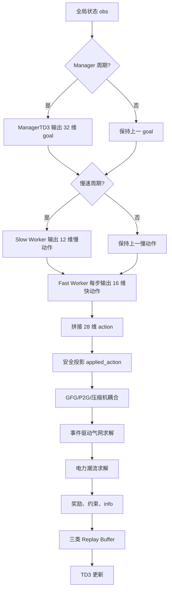

# 项目总览

## 1. 研究问题

电-气耦合微电网（coupled electric-gas microgrid）同时包含配电网和天然气网络。电力系统侧有负荷、线路、电压、新能源和储能；天然气系统侧有高压管网、气源、气负荷、压缩机和压力约束。两者通过燃气发电 GFG（gas-fired generation）、电转气 P2G（power-to-gas）和电驱压缩机耦合：GFG 消耗天然气并向电网发电，P2G 消耗电能并向气网注气，压缩机消耗电力调节气体压力。

这种系统天然具有多时间尺度特征。逆变器无功和新能源削减可以每 3 分钟快速响应电压波动；ESS、GFG、P2G、压缩机的基准设定更适合在小时级调整；跨系统协调目标则可以更慢地更新。若把所有动作都塞进单一时间尺度强化学习，经验回放语义会混乱，慢动作会被重复存储，快速控制会被高层目标噪声干扰，训练更容易出现不稳定。

本项目采用 FuN-inspired Hierarchical Multi-Timescale TD3。它不是严格原始 FuN，而是借鉴 Manager-Worker 思路，将控制拆分为：

- Manager：读取全局状态，每默认 40 步输出一次 32 维组合式 goal。
- 慢速 Worker：每 20 步输出 ESS、GFG、P2G、压缩机等 12 维慢速动作。
- 快速 Worker：每步输出 8 个逆变器无功和 8 个新能源削减率，共 16 维快速动作。

## 2. 控制目标

环境奖励以外在系统成本和约束惩罚为主，目标包括：

- 保持母线电压在 0.95 至 1.05 pu 附近；
- 限制线路负载率；
- 降低电网有功损耗；
- 控制高压气网压力在 30 至 70 bar；
- 保持 PRS 出口压力在 1.35 至 1.65 bar；
- 保持 ESS SOC 在安全范围内，并限制日终 SOC 偏移；
- 减少外部购电和购气；
- 减少新能源削减；
- 控制压缩机耗电；
- 减少 ESS、GFG、P2G 动作突变；
- 避免 pandapower/pandapipes 求解失败。

## 3. 三层架构

当前代码中的时间尺度如下：

| 层级 | 周期 | 代码字段 | 输出 |
| --- | ---: | --- | --- |
| 快速 Worker | 1 步 = 3 分钟 | `FAST_INTERVAL = 1` | 16 维快速动作 |
| 慢速 Worker | 20 步 = 1 小时 | `SLOW_INTERVAL = 20` | 12 维慢速动作 |
| Manager | 默认 40 步 = 2 小时 | `MANAGER_INTERVAL = 40` | 32 维 goal |
| episode | 480 步 = 1 天 | `EPISODE_STEPS = 480` | 一天仿真 |

## 4. 一次完整决策过程

```text
读取当前全局状态
→ 若到达 Manager 周期，Manager 生成/平滑组合式 goal
→ 若到达慢速周期，慢速 Worker 更新 ESS/GFG/P2G/压缩机动作
→ 快速 Worker 每步更新逆变器无功和新能源削减动作
→ 拼接 28 维联合动作
→ 环境执行安全投影，得到 applied_action
→ GFG/P2G/压缩机进行电-气耦合换算
→ 事件调度器判断是否运行 pandapipes pipeflow
→ pandapower 运行 AC 潮流
→ 更新 ESS SOC 与气网状态年龄
→ 计算 reward_components 和 constraint_metrics
→ 写入 fast/slow/manager replay buffer
→ TD3 按各自频率更新 Actor、Critic、Encoder 和 Target 网络
```

## 5. 流程图



## 6. 项目适用范围

适合：

- 多能源系统控制算法研究；
- 分层强化学习原型验证；
- 多时间尺度经验回放和异步决策实验；
- pandapower/pandapipes 耦合求解链路调试；
- 论文实验框架扩展。

不适合：

- 未经物理参数校准的工程调度；
- 未经安全验证的真实电网/气网控制；
- 将准稳态气网结果解释为完整瞬态 linepack 动态。

