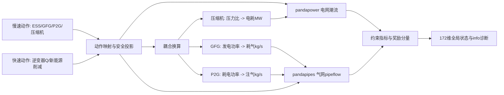

# 系统物理模型

## 0. 电-气耦合数据流

下面这张图概括了一次控制步内电力网络、天然气网络和耦合设备之间的主要信息流。它不是新的求解算法，只是把当前代码中的显式手工耦合过程画出来，便于读者把 GFG、P2G、压缩机和两个网络的边界关系对应起来。



## 1. 电力网络

电力系统使用 IEEE 33 节点辐射型配电网。当前代码中的主要参数来自 [electric_gas_microgrid_single.py](../electric_gas_microgrid_single.py)：

| 项目 | 数值 |
| --- | --- |
| 节点数 | 33 |
| 线路数 | 32 |
| 基准电压 | 12.66 kV |
| 基准容量 | 10 MVA |
| Slack 母线 | 0 |
| Slack 电压 | 1.0 pu |
| 电压安全范围 | 0.95 至 1.05 pu |
| 线路负载上限 | 100% |

负荷数据保存在 `IEEE33_LOAD_DATA`，线路阻抗保存在 `IEEE33_LINE_DATA`。GFG 电侧使用 `sgen`，P2G 和压缩机电侧使用独立 `load`，ESS 使用 pandapower `storage`。

### ESS 储能

| 名称 | 母线 | 最大功率 MW | 容量 MWh | 初始 SOC | SOC 范围 |
| --- | ---: | ---: | ---: | ---: | --- |
| ESS_0 | 6 | 1.0 | 4.0 | 0.50 | 0.10 至 0.95 |
| ESS_1 | 15 | 1.0 | 4.0 | 0.50 | 0.10 至 0.95 |
| ESS_2 | 29 | 0.5 | 2.0 | 0.50 | 0.10 至 0.95 |

项目遵循 pandapower storage 的符号约定：

```text
p_mw > 0：储能从电网吸收功率，即充电
p_mw < 0：储能向电网注入功率，即放电
```

SOC 更新公式：

$$
\Delta E =
\begin{cases}
\eta_{\mathrm{charge}} P \Delta t, & P \ge 0 \\
P \Delta t / \eta_{\mathrm{discharge}}, & P < 0
\end{cases}
$$

$$
\mathrm{SOC}_{t+1}=\mathrm{SOC}_t+\frac{\Delta E}{E_{\mathrm{cap}}}
$$

代码在写入 pandapower 前调用 `project_ess_batch` / `project_ess_power` 做安全投影，而不是先越限再简单裁剪 SOC。

### 新能源逆变器

当前共有 8 个可控新能源逆变器：

| 名称 | 母线 | 类型 | 容量 MW | 额定容量 MVA | 最大削减率 |
| --- | ---: | --- | ---: | ---: | ---: |
| PV_0 | 9 | pv | 1.0 | 1.08 | 0.50 |
| PV_1 | 13 | pv | 1.0 | 1.08 | 0.50 |
| WT_0 | 17 | wind | 1.5 | 1.60 | 0.50 |
| WT_1 | 20 | wind | 1.5 | 1.60 | 0.50 |
| PV_2 | 23 | pv | 1.0 | 1.08 | 0.50 |
| PV_3 | 24 | pv | 1.0 | 1.08 | 0.50 |
| WT_2 | 31 | wind | 1.0 | 1.05 | 0.50 |
| PV_4 | 32 | pv | 1.0 | 1.08 | 0.50 |

逆变器约束：

$$
P^2+Q^2\le S_{\mathrm{rated}}^2
$$

实际有功为：

$$
P_{\mathrm{actual}}=P_{\mathrm{available}}(1-\mathrm{curtailment})
$$

无功能力由：

$$
Q_{\max}=\sqrt{\max(S_{\mathrm{rated}}^2-P_{\mathrm{actual}}^2,0)}
$$

代码使用 `project_inverter_action` 裁剪无功和削减率。

## 2. 天然气网络

天然气系统采用 Belgian 20 节点高压网络：

| 项目 | 数值 |
| --- | ---: |
| 高压气节点 | 20 |
| 管道 | 23 |
| 气源 | 6 |
| 压缩机 | 3 |
| 高压压力范围 | 30 至 70 bar |
| PRS 出口压力 | 1.5 bar |
| PRS 出口安全范围 | 1.35 至 1.65 bar |

`GAS_NODES` 保存节点气负荷和压力上下限。`GAS_PIPES` 保存管道端点、`Wmn/Kmn` 参考值和临时等效管道参数。`GAS_SUPPLIERS` 保存 6 个供应商节点、容量和成本参考。

重要限制：

- `length_km`、`diameter_m`、`roughness_mm` 是临时等效参数。
- `Wmn/Kmn` 只作为文献参考字段保留，不直接作为 pandapipes 物理管道参数。
- 所有气源和压缩机参数都带有校准风险。
- PRS 低压出口以虚拟状态表示，不把 1.5 bar 出口强行塞进 30 至 70 bar 高压约束。

## 3. GFG 燃气发电

| 名称 | 电网母线 | 气网节点 | 最大电功率 MW | 效率 |
| --- | ---: | ---: | ---: | ---: |
| GFG_0 | 18 | 4 | 2.0 | 0.38 |
| GFG_1 | 22 | 5 | 2.0 | 0.38 |
| GFG_2 | 32 | 18 | 1.5 | 0.36 |

GFG 从气网取气并向电网发电：

$$
\dot m_{\mathrm{GFG}}=
\frac{P_{\mathrm{GFG}}}{\eta_{\mathrm{GFG}}\mathrm{HHV}}
$$

其中 `HHV_MJ_per_kg = 50.0` 是待校准值，单位关系为 `1 MW = 1 MJ/s`。

## 4. P2G 电转气

| 名称 | 电网母线 | 气网节点 | 最大电功率 MW | 效率 |
| --- | ---: | ---: | ---: | ---: |
| P2G_0 | 7 | 7 | 1.5 | 0.70 |
| P2G_1 | 24 | 14 | 1.5 | 0.70 |
| P2G_2 | 30 | 19 | 1.0 | 0.65 |

P2G 消耗电力并向气网注入天然气：

$$
\dot m_{\mathrm{P2G}}=
\frac{\eta_{\mathrm{P2G}}P_{\mathrm{P2G}}}{\mathrm{HHV}}
$$

注意：P2G 不是压缩机。P2G 产生气体质量流，压缩机只消耗电力调节气体压力。

## 5. 电驱压缩机

| 名称 | 起点气节点 | 终点气节点 | 初始压力比 | 压力比范围 | 额定流量 kg/s | 最大功率 MW |
| --- | ---: | ---: | ---: | --- | ---: | ---: |
| COMP_8_to_18 | 7 | 17 | 1.15 | 1.0 至 1.5 | 4.0 | 0.25 |
| COMP_14_to_15 | 13 | 14 | 1.10 | 1.0 至 1.5 | 4.0 | 0.25 |
| COMP_17_to_18 | 16 | 17 | 1.15 | 1.0 至 1.5 | 4.0 | 0.25 |

压缩机模型位于 `compressor_model.py` 和单文件环境的同名实现中。它使用压力比、等熵效率、额定质量流量和功率上限估计电功率消耗。当前是简化等效模型，`nominal_flow_kg_s`、最大功率和方向都应进一步校准。

## 6. 事件驱动气网求解

电网每个 3 分钟步都会运行潮流。气网采用事件驱动：

- 整点或慢速动作变化时运行 pipeflow；
- GFG 耗气、P2G 注气、压缩机压力比、气负荷变化超过阈值时提前运行；
- 其他快速步复用最近有效气网结果，并增加 `gas_state_age`。

这是一种稳态/准稳态近似，不是天然气瞬态 PDE 模型。

## 7. equivalent_linepack_indicator

`equivalent_linepack_indicator` 是根据当前 pipeflow 压力场、临时管道体积和气体参数估计的准稳态指标。它可以帮助策略感知“当前压力场对应的等效气体存量趋势”，但不能把它描述为严格动态 linepack。若研究动态管存，需要引入瞬态气网模型或显式离散气体质量守恒。
