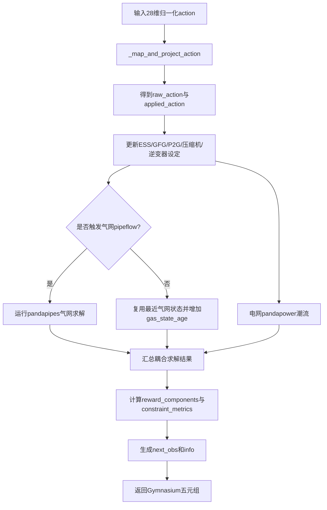

# 环境接口教程

## 1. 环境类

训练主程序实际使用的环境类为：

```python
from electric_gas_microgrid_single import ElectricGasMultiScaleEnv
```

模块化版本中也有同名类：

```python
from project.envs.electric_gas_multiscale_env import ElectricGasMultiScaleEnv
```

但 [hierarchical_td3_electric_gas.py](../hierarchical_td3_electric_gas.py) 导入的是顶层单文件环境。文档中除非特别说明，均以顶层 `electric_gas_microgrid_single.ElectricGasMultiScaleEnv` 为准。

## 2. reset 接口

```python
env = ElectricGasMultiScaleEnv()
obs, info = env.reset(seed=42)
```

返回：

| 名称 | 类型 | 当前事实 |
| --- | --- | --- |
| `obs` | `np.ndarray` | 形状 `(172,)`，全局归一化状态 |
| `info` | `dict` | 初始求解信息、奖励分量、约束指标、动作投影等 |

## 3. step 接口

```python
next_obs, reward, terminated, truncated, info = env.step(action)
```

| 返回值 | 含义 |
| --- | --- |
| `next_obs` | 下一时刻 172 维全局状态 |
| `reward` | 环境外在奖励，等于所有惩罚/成本分量之和取负 |
| `terminated` | 达到一天 480 步时为 `True` |
| `truncated` | 连续求解失败达到上限时为 `True` |
| `info` | 求解、约束、投影、奖励分量等诊断信息 |

## 3.1 step 执行流程

`step()` 的核心逻辑位于 [electric_gas_microgrid_single.py](../electric_gas_microgrid_single.py)。下图对应当前实现的主要顺序：先把归一化动作转成物理动作并投影，再求解电力/气体网络，最后组装奖励、状态和诊断信息。



## 4. 动作空间

当前动作空间为 28 维 `Box(-1, 1)`：

| 归一化索引 | 设备 | 数量 | 时间尺度 | 物理含义 |
| --- | --- | ---: | --- | --- |
| `0:3` | ESS | 3 | 慢速 | 储能功率，`-1` 为最大放电，`1` 为最大充电 |
| `3:6` | GFG | 3 | 慢速 | 燃气发电功率，映射到 `[0, max_p_mw]` |
| `6:9` | P2G | 3 | 慢速 | 电转气输入功率，映射到 `[0, max_p_mw]` |
| `9:12` | Compressor | 3 | 慢速 | 压缩机压力比，映射到 `[min_pressure_ratio, max_pressure_ratio]` |
| `12:20` | Renewable inverter Q | 8 | 快速 | 逆变器无功指令，先映射到额定 MVA 再投影 |
| `20:28` | Renewable curtailment | 8 | 快速 | 新能源削减率，映射到 `[0, max_curtailment]` |

动作拼接顺序在 `_map_and_project_action()` 中实现。非慢速时刻传入的新慢动作不会被应用，环境保留上一实际慢速动作，并在 `info["slow_action_applied"]` 中标记。

## 5. 动作归一化和安全投影

慢速动作：

- ESS：`p_mw = action * max_p_mw`，随后按 SOC 可行域投影；
- GFG/P2G：`p_mw = 0.5 * (action + 1) * max_p_mw`；
- 压缩机：`ratio = min_ratio + 0.5 * (action + 1) * (max_ratio - min_ratio)`。

快速动作：

- 逆变器无功：`q_request = action * s_rated_mva`；
- 削减率：`curtailment = 0.5 * (action + 1) * max_curtailment`；
- 再通过 `P^2 + Q^2 <= S^2` 做安全投影。

环境会把投影后的物理动作反算为归一化 `applied_action`，用于 TD3 Critic 的经验回放。

## 6. 状态空间

顶层全局状态维度为 172。构造位置在 `get_global_state()`。

主要组成：

| 类别 | 字段概念 |
| --- | --- |
| 电力状态 | 33 个母线电压偏差、32 条线路负载率、负荷倍率、新能源可用/实际/无功、外部购电、网损 |
| ESS | SOC、归一化 ESS 功率、SOC 边界裕度 |
| 气网 | 20 个高压节点压力、3 个 PRS 虚拟压力、3 个压缩机压力比、气源流量、GFG 耗气、P2G 注气 |
| 管道 | 23 条管道质量流量 |
| 时间与预测 | 小时正余弦、日内进度正余弦、下一小时负荷倍率、下一小时新能源总可用功率 |
| 准稳态指标 | `gas_state_age`、`equivalent_linepack_indicator` |

专用观测接口：

| 接口 | 当前维度 | 含义 |
| --- | ---: | --- |
| `get_global_state()` | 172 | 完整环境状态 |
| `get_manager_state()` | 172 | 当前直接返回全局状态 |
| `get_fast_worker_state()` | 109 | 环境快速状态切片 |
| `get_slow_worker_state()` | 63 | 环境慢速状态切片 |

训练脚本中的 `ObservationBuilder` 进一步补充上下文，因此训练实际维度为：

| 训练观测 | 维度 | 说明 |
| --- | ---: | --- |
| Manager | 172 | `get_manager_state()` |
| Fast Worker | 116 | 快速状态 + 时间/预测 + Manager goal age + ESS/慢动作摘要 |
| Slow Worker | 84 | 慢速状态 + 时间/预测摘要 |

## 7. info 字典

一次 `step()` 返回的重要字段：

| 字段 | 含义 |
| --- | --- |
| `step` | 当前步编号 |
| `slow_action_applied` | 本步是否真正应用新的慢速动作 |
| `converged` | 电/气求解综合收敛标记 |
| `solver_failed` | 本步是否由异常处理转换为失败 transition |
| `power_converged` | pandapower 潮流是否成功 |
| `gas_converged` | pandapipes pipeflow 是否成功 |
| `gas_solved_this_step` | 本步是否实际运行气网求解 |
| `gas_solve_reason` | 气网求解触发原因 |
| `gas_state_age` | 距上次气网求解的快速步数 |
| `gas_solve_count` | episode 内气网累计求解次数 |
| `equivalent_linepack_indicator` | 准稳态等效管存指标 |
| `ess_soc` | 当前 ESS SOC |
| `reward_components` | 奖励/成本分量 |
| `constraint_metrics` | 电压、气压、SOC、购能等指标 |
| `raw_action` | 原始 28 维归一化动作 |
| `applied_action` | 安全投影后反算的 28 维归一化动作 |
| `action_projection_magnitude` | `raw_action - applied_action` 的范数 |
| `ess_projection` | ESS 原始/实际功率和投影幅度 |
| `inverter_projection` | 逆变器投影信息 |

`reward_components` 当前字段：

```text
voltage_violation, high_pressure_violation, prs_pressure_violation,
line_overload, power_loss, grid_purchase, gas_purchase,
renewable_curtailment, ess_action_change, gfg_action_change,
p2g_action_change, compressor_energy, soc_soft, solver_failure,
terminal_soc
```

`constraint_metrics` 当前字段：

```text
vm_min_pu, vm_max_pu, max_line_loading_percent,
high_pressure_min_bar, high_pressure_max_bar,
prs_pressure_min_bar, prs_pressure_max_bar,
soc_min, soc_max, grid_purchase_mwh, gas_purchase_kg
```

## 8. 示例：运行 10 步

```python
from electric_gas_microgrid_single import ElectricGasMultiScaleEnv

env = ElectricGasMultiScaleEnv()
obs, info = env.reset(seed=42)

for t in range(10):
    action = env.action_space.sample()
    obs, reward, terminated, truncated, info = env.step(action)
    print(
        t,
        float(reward),
        info["slow_action_applied"],
        info["gas_solved_this_step"],
        info["constraint_metrics"]["vm_min_pu"],
        info["action_projection_magnitude"],
    )
    if terminated or truncated:
        break
```

## 9. 示例：执行一个完整小时

一个小时等于 20 个 3 分钟步。慢速动作只在第 0 步应用一次，之后保持。

```python
from electric_gas_microgrid_single import ElectricGasMultiScaleEnv

env = ElectricGasMultiScaleEnv()
obs, _ = env.reset(seed=0)
slow_updates = 0

for t in range(20):
    obs, reward, terminated, truncated, info = env.step(env.action_space.sample())
    slow_updates += int(info["slow_action_applied"])

print("slow updates in one hour:", slow_updates)
```
