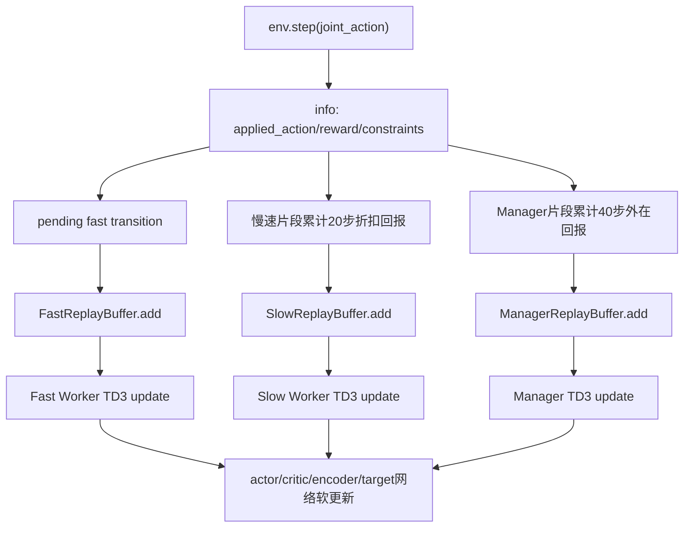
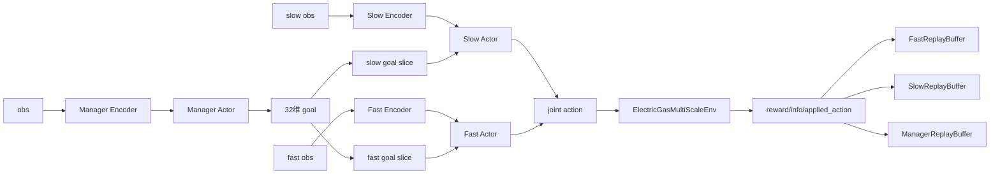

# 分层强化学习算法

## 1. 方法定位

当前训练程序更准确地称为：

```text
FuN-inspired Hierarchical Multi-Timescale TD3
```

它借鉴 Feudal Network 中 Manager 输出目标、Worker 追踪目标的思想，但并不严格实现原始 FuN 的全部机制。代码没有 HIRO 式 off-policy correction 或 goal relabeling；实际实现是三个异步 TD3 智能体加三个 Replay Buffer。

## 2. Manager

类名：`ManagerTD3`

| 项目 | 当前实现 |
| --- | --- |
| 输入 | 172 维 Manager 观测 |
| Encoder | `MLPEncoder(obs_dim, manager_latent_dim=64)` |
| Actor | `ManagerActor(64 -> 32)` |
| Critic | `ManagerCritic(z_manager, goal)`，双 Critic |
| 决策周期 | 默认 40 步 |
| 经验跨度 | 默认 40 个环境步 |
| 折扣 | `gamma_manager = gamma_fast ** manager_interval` |

Manager 的 goal 会经过噪声、归一化和平滑：

```python
goal = normalize((1 - goal_smoothing) * new_goal + goal_smoothing * previous_goal)
```

目标变化惩罚由 `goal_change_penalty_weight` 控制。

## 3. 组合式 goal

当前 goal 维度为 32：

| 切片 | 维度 | 语义 |
| --- | ---: | --- |
| `0:8` | 8 | `g_shared`，跨时间尺度共享潜在方向 |
| `8:16` | 8 | `g_slow`，慢速 Worker 目标方向 |
| `16:24` | 8 | `g_fast`，快速 Worker 目标方向 |
| `24:32` | 8 | `g_physical`，物理参考目标 |

`g_shared`、`g_slow`、`g_fast` 通过 `normalize_goal_np` / `normalize_goal_tensor` 做 L2 归一化；`g_physical` 由 `tanh` 限制在 `[-1, 1]`。

## 4. 慢速 Worker

类名：`WorkerTD3(role="slow")`

| 项目 | 当前实现 |
| --- | --- |
| 训练观测维度 | 84 |
| latent 维度 | 32 |
| 输入 goal | `g_shared + g_slow + g_physical`，共 24 维 |
| 输出动作 | 12 维慢速动作 |
| 决策周期 | 20 步 |
| 经验 | `SlowReplayBuffer`，每个慢速片段一条 |
| 折扣 | `gamma_slow = gamma_fast ** slow_interval` |

慢速动作包括 ESS、GFG、P2G 和压缩机压力比。非慢速时刻环境保持上一次实际慢速动作。

## 5. 快速 Worker

类名：`WorkerTD3(role="fast")`

| 项目 | 当前实现 |
| --- | --- |
| 训练观测维度 | 116 |
| latent 维度 | 32 |
| 输入 goal | `g_shared + g_fast + g_physical`，共 24 维 |
| 输出动作 | 16 维快速动作 |
| 决策周期 | 每步 |
| 经验 | `FastReplayBuffer`，每个环境步一条 |
| 折扣 | `gamma_fast` |

快速动作只控制 8 个逆变器无功和 8 个新能源削减率。

## 6. TD3 机制

三个智能体都采用 TD3 核心思想：

- Twin Critics：每个 Critic 网络输出两个 Q 值；
- Clipped Double Q：目标 Q 使用两个 target Q 的较小值；
- Target Policy Smoothing：目标动作加入截断高斯噪声；
- Delayed Policy Update：Actor 按 `policy_frequency` 延迟更新；
- Soft Target Update：`target = (1 - tau) target + tau online`；
- Gradient Clipping：使用 `gradient_clip` 控制梯度范数；
- 当前优化版还加入 `target_q_clip_abs`、Worker 动作 L2 正则和不同层的更新频率控制。

## 7. 内在奖励

Worker 潜在方向奖励为：

$$
r_t^{latent} =
\cos(z_{t+1}-z_t, g_t)
$$

实现细节：

- `z_t` 和 `z_{t+1}` 都由同一个 `target_encoder` 计算，保持潜在坐标系一致；
- 若 `||z_{t+1}-z_t|| < delta_z_min`，内在奖励设为 0；
- 使用 `1e-8` 数值稳定项；
- goal 的 8 维方向会平铺并归一化到 Worker latent 维度。

## 8. 物理目标奖励

物理目标奖励是 progress-based：

$$
r_t^{progress}=d(s_t,g)-d(s_{t+1},g)
$$

快速 Worker 当前使用电压偏差和线路过载进展。慢速 Worker 使用 SOC 参考和气压归一化越界趋势。它们是轻量 shaping，不替代环境外在奖励。

## 9. Worker 总奖励

```python
r_worker = (
    alpha_external * external
    + beta_latent * latent
    + beta_physical * physical
    + projection_penalty
)
```

默认权重：

| 参数 | 默认值 |
| --- | ---: |
| `alpha_external` | 1.0 |
| `beta_latent` | 0.10 |
| `beta_physical` | 0.20 |
| `lambda_projection` | 0.10 |
| `worker_reward_clip_abs` | 5000 |
| `manager_reward_clip_abs` | 25000 |

## 10. Encoder 训练

Manager、快速 Worker、慢速 Worker 各有独立 Encoder 和 Target Encoder。

Worker Encoder 由以下损失推动：

```text
critic_loss + lambda_transition * transition_encoder_loss + lambda_latent_norm * latent_norm_loss
```

当 `--use-transition-model` 开启时，`TransitionModel` 学习预测 latent delta。`reachability_weight` 默认是 0，因此当前不会额外给 Actor 加 goal reachability loss，除非用户显式修改配置。

## 11. 经验回放

| Buffer | 添加频率 | transition 跨度 | 主要字段 |
| --- | ---: | ---: | --- |
| `FastReplayBuffer` | 每步 | 1 步 | `obs`, `next_obs`, `raw_actions`, `executed_actions`, `reward_external`, `reward_intrinsic`, `reward_total`, `goals`, `next_goals`, `goal_changed`, `dones` |
| `SlowReplayBuffer` | 每 20 步或 episode 末尾 | 慢速片段 | `obs_start`, `obs_end`, `raw_actions`, `executed_actions`, `discounted_reward`, `goals`, `next_goals`, `dones`, `duration_steps` |
| `ManagerReplayBuffer` | 每 40 步或 episode 末尾 | 宏观片段 | `global_obs_start`, `global_obs_end`, `manager_goals`, `discounted_external_reward`, `dones`, `duration_steps` |

经验回放的数据流如下。注意 Critic 使用的是环境安全投影后的 `executed_actions` / `applied_action`，而不是策略网络最初输出的未投影动作，这一点对带物理约束的连续控制很重要。



## 12. 异步折扣

代码中实现：

$$
\gamma_{\mathrm{slow}}=\gamma_{\mathrm{fast}}^{C_s}
$$

$$
\gamma_{\mathrm{manager}}=\gamma_{\mathrm{fast}}^{C_m}
$$

其中 `C_s = slow_interval = 20`，`C_m = manager_interval = 40`。

## 13. 三层数据流图



## 14. 训练伪代码

```text
for episode:
    reset env
    for t in episode_steps:
        if t % manager_interval == 0:
            finalize previous manager segment
            current_goal = Manager(obs)

        if pending_fast exists:
            finalize fast transition with next_goal

        if t % slow_interval == 0:
            finalize previous slow segment
            slow_action = SlowWorker(slow_obs, current_goal)

        fast_action = FastWorker(fast_obs, current_goal)
        joint_action = concat(slow_action, fast_action)
        next_obs, reward, done, info = env.step(joint_action)

        store pending fast transition using info["applied_action"]
        accumulate slow and manager rewards

        if enough samples:
            update fast each step
            update slow every slow_update_interval_steps
            update manager every manager_update_interval_steps
```
