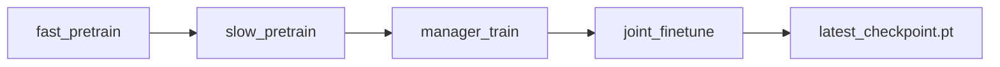

# 训练教程

## 1. 环境准备

项目当前实测环境为 Windows + Conda：

```powershell
D:\anaconda\anaconda\envs\python_3_8\python.exe
```

主要依赖见根目录 [requirements.txt](../requirements.txt)：

| 包 | 已验证版本或约束 | 用途 |
| --- | --- | --- |
| `numpy` | `1.23.5` | 数值计算 |
| `pandas` | `2.0.3` | CSV/表格处理 |
| `pandapower` | `2.14.10` | 电力潮流 |
| `pandapipes` | `0.10.0` | 天然气 pipeflow |
| `torch` | `1.12.1` | TD3 网络训练 |
| `tensorboard` | 未固定 | 训练曲线 |
| `protobuf` | `<=3.20.3` | TensorBoard 兼容 |
| `gymnasium` | 未固定 | Box 接口优先使用 |
| `pytest` | 未固定 | 单元测试 |

Windows PowerShell：

```powershell
cd D:\project\FuN_TD3_project
& 'D:\anaconda\anaconda\envs\python_3_8\python.exe' -m pip install -r requirements.txt
```

Linux/macOS：

```bash
cd /path/to/FuN_TD3_project
python -m pip install -r requirements.txt
```

若要安装 CUDA 版本 PyTorch，请按你的 CUDA 版本到 PyTorch 官方渠道选择安装命令；文档不假设所有机器都有 CUDA。训练脚本默认 `--device auto`，会优先使用可用 CUDA，否则使用 CPU。

## 2. 运行前检查

### 依赖导入

```powershell
& 'D:\anaconda\anaconda\envs\python_3_8\python.exe' -c "import numpy, pandas, pandapower, pandapipes, torch; print(numpy.__version__, pandas.__version__, pandapower.__version__, pandapipes.__version__, torch.__version__)"
```

### 编译检查

```powershell
& 'D:\anaconda\anaconda\envs\python_3_8\python.exe' -m py_compile electric_gas_microgrid_single.py hierarchical_td3_electric_gas.py evaluate_hierarchical_agent.py
```

### 单元测试

```powershell
& 'D:\anaconda\anaconda\envs\python_3_8\python.exe' -m pytest project/tests -q
```

文档生成前已验证：`15 passed, 1 warning`。

### 内置最低测试

```powershell
& 'D:\anaconda\anaconda\envs\python_3_8\python.exe' hierarchical_td3_electric_gas.py --run-tests
```

该测试会检查环境 reset、动作维度、时间尺度、Replay Buffer、Encoder 更新、checkpoint 保存/加载和短训练。

## 3. 调试训练

短时调试建议只跑 20 步：

```powershell
.\scripts\debug_train.ps1
```

等价命令：

```powershell
& 'D:\anaconda\anaconda\envs\python_3_8\python.exe' hierarchical_td3_electric_gas.py --training-stage joint_finetune --episodes 1 --episode-steps 20 --manager-interval 40 --batch-size 8 --learning-starts 5 --use-transition-model --device cpu --checkpoint-dir runs\debug
```

Linux/macOS：

```bash
python hierarchical_td3_electric_gas.py --training-stage joint_finetune --episodes 1 --episode-steps 20 --manager-interval 40 --batch-size 8 --learning-starts 5 --use-transition-model --device cpu --checkpoint-dir runs/debug
```

## 4. 分阶段训练

训练阶段由 `--training-stage` 指定：

| 阶段 | 训练模块 | 冻结/规则部分 | 目的 |
| --- | --- | --- | --- |
| `fast_pretrain` | 快速 Worker | Manager 固定 goal，慢速动作用规则策略 | 先学逆变器快速控制 |
| `slow_pretrain` | 慢速 Worker | 快速 Worker 无噪声动作，Manager 固定参考 | 学 ESS/GFG/P2G/压缩机慢动作 |
| `manager_train` | Manager | 两个 Worker 冻结为确定性策略 | 学高层 goal |
| `joint_finetune` | 三层联合 | Worker 学习率用 `joint_worker_lr` | 联合微调 |
| `all` | 顺序执行四阶段 | 自动串接 checkpoint | 从零开始的推荐入口 |

`all` 会把总 episode 数平均分给四个阶段。例如 `--episodes 300` 时，每个阶段约 75 个 episode。



## 5. 完整训练

没有可信 checkpoint 时，使用四阶段训练：

```powershell
.\scripts\train_final_m40.ps1
```

该脚本默认使用：

```text
training-stage = all
episodes = 300
episode-steps = 480
manager-interval = 40
batch-size = 256
learning-starts = 1000
use-transition-model = true
checkpoint-dir = runs\m40_stability_v1
```

若已有可信 checkpoint：

```powershell
.\scripts\train_final_m40.ps1 -LoadCheckpoint checkpoints\latest_checkpoint.pt
```

注意：PyTorch `.pt` checkpoint 使用 pickle 反序列化。只加载你信任来源的文件。

## 6. TensorBoard

```powershell
tensorboard --logdir runs
```

主要曲线：

| 曲线 | 含义 |
| --- | --- |
| `episode/return` | 每个 episode 环境总回报 |
| `eval/return` | 无探索噪声评估回报 |
| `components/*` | 环境奖励分量 |
| `constraints/*` | 电压、气压、SOC 等约束与稳定性指标 |
| `loss/*critic_loss` | Critic 损失 |
| `loss/*actor_loss` | Actor 损失 |
| `loss/*q_value` | Q 值均值 |
| `reward/*latent` | Worker 潜在方向奖励 |
| `episode/mean_action_projection` | 安全投影平均幅度 |
| `episode/mean_voltage_rms_deviation_pu` | episode 平均电压 RMS 偏差 |
| `episode/mean_high_pressure_rms_deviation_bar` | episode 平均高压气网 RMS 偏差 |
| `episode/mean_prs_pressure_rms_deviation_bar` | episode 平均 PRS 出口 RMS 偏差 |
| `solver/failure_count` | episode 内求解失败次数 |

## 7. Checkpoint

每个 run 目录可能包含：

```text
config.json
latest_checkpoint.pt
best_fast_worker.pt
best_slow_worker.pt
best_manager.pt
episode_log.csv
tb/events.out.tfevents...
```

当前 `save_checkpoint()` 保存字段：

| 字段 | 内容 |
| --- | --- |
| `config` | `TrainConfig` 字典 |
| `manager` | Manager 网络、优化器和 normalizer |
| `slow` | 慢速 Worker 网络、优化器和 normalizer |
| `fast` | 快速 Worker 网络、优化器和 normalizer |
| `episode` | 保存时 episode |
| `global_step` | 累计环境步 |
| `best_return` | 当前最佳评估回报 |

## 8. 推荐参数表

| 参数 | 默认值 | 说明 |
| --- | ---: | --- |
| `gamma_fast` | 0.99 | 快速折扣 |
| `tau` | 0.005 | target soft update |
| `batch_size` | 256 | 训练 batch |
| `learning_starts` | 1000 | 开始训练前的环境步数 |
| `policy_frequency` | 2 | Actor 延迟更新频率 |
| `slow_update_interval_steps` | 5 | 慢速 Worker 更新间隔 |
| `manager_update_interval_steps` | 20 | Manager 更新间隔 |
| `target_noise` | 0.08 | 正式脚本使用的 TD3 target smoothing 噪声 |
| `target_noise_clip` | 0.20 | 正式脚本使用的目标噪声截断 |
| `target_q_clip_abs` | 200000 | target Q 裁剪 |
| `fast_lr` / `slow_lr` | 3e-4 | 预训练 Worker 学习率 |
| `manager_lr` | 1e-4 | Manager 学习率 |
| `joint_worker_lr` | 1e-4 | 联合微调 Worker 学习率 |
| `manager_interval` | 40 | Manager 周期 |
| `slow_interval` | 20 | 慢速动作周期 |
| `worker_reward_clip_abs` | 5000 | Worker reward target 裁剪 |
| `manager_reward_clip_abs` | 25000 | Manager reward target 裁剪 |
| `lambda_projection` | 10.0 | 正式脚本使用的动作投影惩罚权重 |
| `worker_action_l2_weight` | 0.01 | 正式脚本使用的 Worker Actor 动作幅值正则 |
| `projection_imitation_weight` | 5.0 | 正式脚本使用的 raw action 向 applied action 靠拢的 Actor 正则 |
| `use_ess_action_guard` | true | 训练和评估默认开启的 SOC-aware ESS 动作保护 |

## 9. 训练成功的判断

不要只看总奖励。建议同时检查：

- `solver_failures` 是否接近 0；
- `vm_min_pu`、`vm_max_pu` 是否逐渐回到安全区间；
- `high_pressure_min_bar`、`high_pressure_max_bar` 是否合理；
- `soc_min`、`soc_max` 是否保持在安全范围；
- `mean_action_projection`、`mean_slow_action_projection`、`mean_fast_action_projection` 是否下降；
- `mean_ess_action_guard` 是否逐步下降；若该值长期很高，说明 actor 仍依赖 ESS guard 修正动作；
- `worker_reward_clips` / `manager_reward_clips` 是否减少；
- `eval_return` 是否稳定优于随机策略；
- 多个随机种子是否一致。
