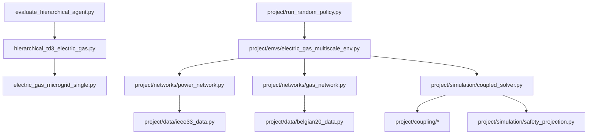
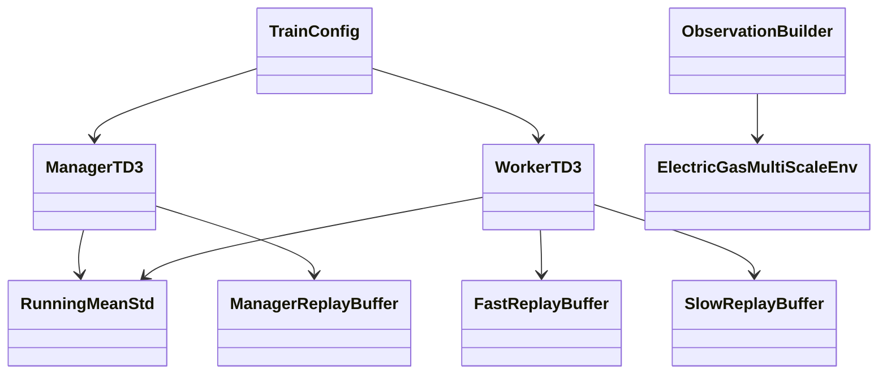
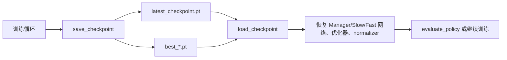

# 代码架构

## 1. 模块依赖图



## 2. 顶层文件职责

| 文件 | 主要职责 | 关键类/函数 | 被谁调用 |
| --- | --- | --- | --- |
| `electric_gas_microgrid_single.py` | 单文件电-气环境、物理模型、可视化入口 | `ElectricGasMultiScaleEnv`, `ProjectConfig`, `PhysicalActions` | 训练脚本、示例 |
| `hierarchical_td3_electric_gas.py` | 分层 TD3 训练系统 | `TrainConfig`, `ManagerTD3`, `WorkerTD3`, `FastReplayBuffer`, `run_training` | 用户 CLI、评估脚本 |
| `evaluate_hierarchical_agent.py` | checkpoint 无噪声评估 | `main`, `parse_args` | 用户 CLI |
| `README.md` | 项目入口 | 无 | 用户 |
| `scripts/*.ps1` | Windows PowerShell 包装命令 | 各脚本参数 | 用户 |

## 3. 模块化 `project/` 目录

| 文件 | 主要职责 |
| --- | --- |
| `project/config.py` | 模块化版本配置 dataclass |
| `project/data/ieee33_data.py` | IEEE 33 线路、负荷、ESS、新能源、GFG、P2G |
| `project/data/belgian20_data.py` | Belgian 20 节点、管道、气源、压缩机 |
| `project/data/profile_generator.py` | 负荷、新能源、气负荷时序曲线 |
| `project/networks/power_network.py` | pandapower 电网构建 |
| `project/networks/gas_network.py` | pandapipes 气网构建 |
| `project/networks/topology_validator.py` | 气网连通性和参数检查 |
| `project/coupling/energy_conversion.py` | P2G/GFG HHV 单位换算 |
| `project/coupling/gfg_model.py` | GFG 调度模型 |
| `project/coupling/p2g_model.py` | P2G 调度模型 |
| `project/coupling/compressor_model.py` | 压缩机功率模型 |
| `project/simulation/safety_projection.py` | ESS 和逆变器安全投影 |
| `project/simulation/event_scheduler.py` | 气网事件驱动求解触发 |
| `project/simulation/coupled_solver.py` | 显式电-气耦合求解 |
| `project/envs/electric_gas_multiscale_env.py` | 模块化 Gym 风格环境 |
| `project/visualization/plots.py` | 随机策略图表 |
| `project/visualization/topology.py` | 电-气拓扑总览图 |
| `project/tests/*.py` | 单元测试 |

## 4. 训练系统类关系



## 5. 数据流

```text
ElectricGasMultiScaleEnv.reset
→ ObservationBuilder 生成三层观测
→ ManagerTD3 / WorkerTD3 产生 goal 和动作
→ ElectricGasMultiScaleEnv.step
→ info 返回 applied_action 与奖励分量
→ 三类 ReplayBuffer 写入经验
→ ManagerTD3.update / WorkerTD3.update
→ save_checkpoint 写入 .pt
```

## 6. Checkpoint 流程



## 7. 测试模块

当前模块化测试覆盖：

- P2G/GFG 能量换算；
- ESS SOC 更新；
- ESS 与逆变器动作投影；
- 气网连通性；
- 电网基础构建；
- 时间尺度；
- 环境 smoke test；
- 可视化输出。

运行：

```powershell
& 'D:\anaconda\anaconda\envs\python_3_8\python.exe' -m pytest project/tests -q
```

